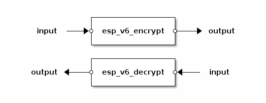

# IPsec ESP Apps (apps.ipsec.ipsec.esp_v6_{encrypt,decrypt})

The pair of apps `esp_v6_encrypt` and `esp_v6_decrypt` implement
packet encryption and decryption with IPsec ESP using AES-GCM-128
algorithm in IPv6 transport mode. Packets are encrypted with a key
provided to the app as configuration. (These apps do not implement any
key exchange protocol.)

The encrypt app receives IPv6 packets and inserts a new [ESP
header](https://en.wikipedia.org/wiki/IPsec#Encapsulating_Security_Payload)
between the outer IPv6 header and the inner protocol header (e.g. TCP,
UDP, L2TPv3) and also encrypts the contents of the inner protocol
header. The decrypt app does the reverse: decrypts the inner protocol
header and removes the ESP protocol header.

References:

- [IPsec wikipedia page](https://en.wikipedia.org/wiki/IPsec).
- [RFC 4106](https://tools.ietf.org/html/rfc4106) on using AES-GCM with IPsec ESP.
- [LISP Data-Plane Confidentiality](https://tools.ietf.org/html/draft-ietf-lisp-crypto-02) example of a software layer above these apps that includes key exchange.

## Configuration

— Key **mode**

*Required*. Encryption mode (string). The only accepted value is the string `"aes-128-gcm"`.

— Key **keymat**

*Required*. Hex string containing 16 bytes of key material as specified in RFC 4106.

— Key **salt**

*Required*. Hex string containing four bytes of salt as specified in RFC 4106.
